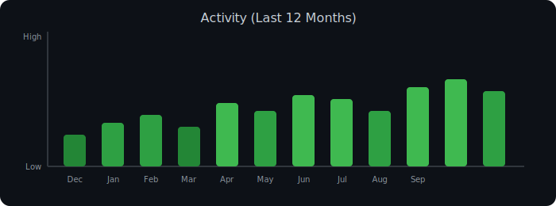

<!--
  GitHub Profile README for: Syed Shams Elahi Ratul (Scarlet McLearn)
-->

<h1 align="center">Hi, I'm Syed Shams Elahi 👋</h1>

<h3 align="center">
  Senior QA Automation Engineer · SQA Lead · Applied Data Scientist
</h3>

  <a href="mailto:GetRatulNow@gmail.com">Email</a> •
  <a href="https://www.linkedin.com/in/SyedElahi">LinkedIn</a> •
  <a href="https://github.com/ScarletMcLearn">GitHub</a> •
  <a href="https://kaggle.com/ScarletMcLearn">Kaggle</a> •
  <a href="https://shorturl.at/LtSgS">QA Portfolio</a> •
  <a href="https://github.com/ScarletMcLearn/DataScience/tree/master/Public">Data Science Portfolio</a>

  

---

### 👨‍💼 Snapshot

- 🔭 **Senior QA Automation Engineer / SQA Lead** with **9+ years** of experience across
  Bangladesh, UAE, Canada, and the US.
- 🧪 Architect of **enterprise-grade test automation frameworks** that reduced testing time
  by **up to 80%** and improved team efficiency by **30%+**.
- 📈 **Applied Data Scientist** with hands-on work in ML, DL, NLP & recommender systems,
  building models that reach **99% accuracy** and boosting engagement by **40%**.
- 🤝 Trusted by teams in **fintech, e-commerce, healthcare, SaaS** to bring structure,
  quality, and speed to delivery.
- 🧭 Comfortable owning **end-to-end quality**: test strategy, framework design, CI/CD,
  performance, observability, and coaching junior engineers.

---

### 🚀 What I Do

#### 🧪 QA Automation & Quality Engineering

- Design **modular, scalable automation frameworks** for web, API, and microservices.
- Lead teams through **test strategy, risk-based planning, and regression optimization**.
- Embed automation into **CI/CD pipelines** (GitHub Actions, Jenkins, Docker, cloud).
- Drive **performance & load testing** for high-traffic applications (JMeter, Locust, Artillery).
- Collaborate closely with dev, product, and DevOps to make **quality a shared responsibility**.

#### 🤖 Applied Data Science & ML for Real Products

- Build **classification, regression, clustering & recommendation** models with strong
  business impact (churn, fraud, medical, customer behavior).
- Use **deep learning & NLP** (BERT, CNNs, Transformers) for text and image problems.
- Deploy models with **MLOps best practices** (Docker, APIs, monitoring, experimentation).
- Apply data science thinking to **testing, observability, and analytics**.

---

### 🧱 Tech Stack (What I Actually Use)

#### 💻 Languages

  
  
  
  
  
  

#### 🧪 Test Automation & QA

  
  
  
  
  
  
  
  

- Test frameworks: **Pytest, TestNG, JUnit, Behave/Cucumber (BDD), Cypress test runner**
- Test domains: **Web, API, microservices, performance, BDD, contract testing**

#### 🤖 Data Science, ML & AI

  
  
  
  
  

- Areas: **classification, regression, clustering, recommendation, NLP, CNNs, LLMs & RAG**
- Tooling: **Pandas, NumPy, XGBoost, LightGBM, MLflow, Spark, BigQuery, Power BI, Tableau**

#### ☁️ DevOps, CI/CD & Cloud

  
  
  
  
  

- CI/CD: GitHub Actions · Jenkins · Bitbucket Pipelines
- Infra: Dockerized test suites · cloud-based cross-browser grids (LambdaTest, BrowserStack)

---

### 🏆 Selected Highlights

- 💡 **Enterprise QA Automation Frameworks**  
  Designed and led implementation of **modular, CI-ready frameworks** that power
  regression, smoke, integration, and performance tests across multiple products.
- ⚡ **Massive Productivity Gains**  
  Automation initiatives cut manual regression by **80%**, improved execution speed,
  and reduced release risk.
- 📊 **High-Accuracy ML Solutions**  
  Delivered ML models (classification, recommendation, NLP) reaching up to **99% accuracy**
  in healthcare, finance, and e-commerce use cases.
- 🌍 **Global, Cross-Functional Experience**  
  Worked with distributed teams in **Bangladesh, UAE, Canada, US**, aligning QA, dev,
  data, and product toward measurable outcomes.
- 🤝 **Mentor & Lead**  
  Lead SQA / SQA Automation Engineer, mentoring engineers, standardizing practices,
  and introducing modern tooling and frameworks.

---

### 🌟 Featured Work

#### 🔧 QA Automation & Testing

- **Playwright Web & API Automation**  
  Enterprise-level POM framework, cross-browser coverage, and hybrid UI + API tests
  to validate microservices end-to-end.

- **Cypress UI & Component Testing**  
  Front-end automation for modern web apps with network stubbing, component tests,
  and integration with test management tools.

- **Selenium & REST Assured Hybrid Framework**  
  Data-driven, parallelized test suite covering UI + API flows with detailed HTML reports
  and CI integration.

- **Performance & Load Testing**  
  JMeter / Locust / Artillery suites simulating thousands of concurrent users, integrated
  into pipelines as quality gates.

> 🔗 Check more details in my QA portfolio: **https://shorturl.at/LtSgS**

#### 📊 Data Science & Machine Learning

A large public portfolio of notebooks and projects covering:

- **Medical, financial & customer analytics** (churn, fraud, risk, survival analysis)
- **Recommender systems** (movies, books, products, restaurants, music)
- **NLP tasks** (sentiment analysis, fake news, topic modeling, text classification)
- **Computer vision** (brain tumor detection, skin disease, image quality classification)
- **LLMs & fine-tuning** (LLaMA / HF models, RAG, prompt engineering)

> 🔗 Data Science portfolio (notebooks):  
> **https://github.com/ScarletMcLearn/DataScience/tree/master/Public**

---

### 📊 Activity (Last 12 Months)

---

### 💼 For Recruiters & Hiring Managers

If you’re looking for someone who can:

- Own **QA strategy & automation** for complex products
- Build **frameworks**, not just scripts
- Collaborate with **engineering, product, and data** teams
- Bring **data science, ML, and LLMs** into your quality & analytics stack

…then we should talk.

---

### 📫 Let’s Connect

  
  
  
  

<!--
Tips:
- Replace any placeholder repo links with your actual frameworks.
- You can add a banner image at the top for extra personality.
-->
